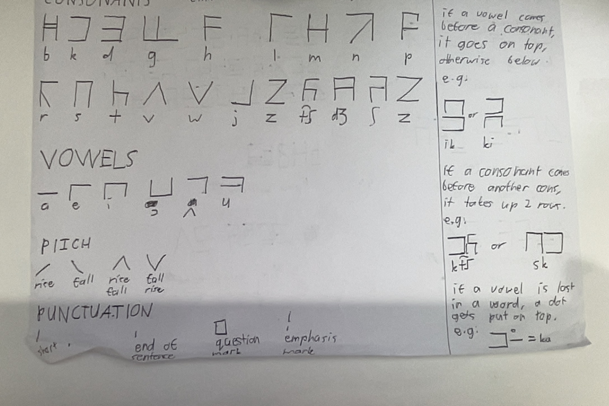

# Table of Contents
- [Keken Alphabet](#keken-alphabet)
- [Related Pages](#related-pages)

# Keken Alphabet
The Keken conlang has a boring one-phoneme-per-letter alphabet.

# Related Pages
- [Dictionary](dictionary.md)
- [Word Modifiers](word_modifiers.md)
- [Asking Questions](asking_questions.md)
- [Commands](commands.md)
- [Keken Alphabet](keken_alphabet.md)
- [Adverbs](adverbs.md)