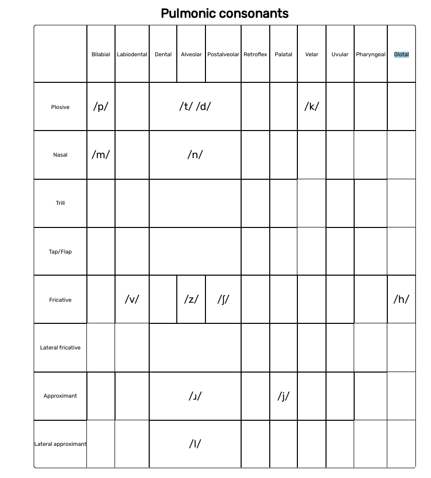
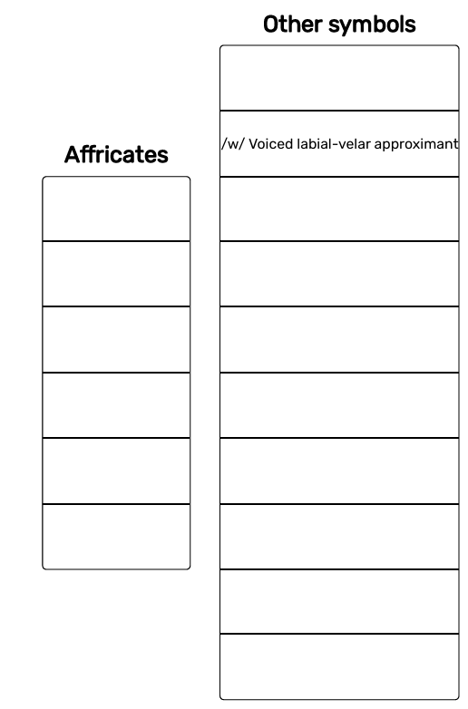
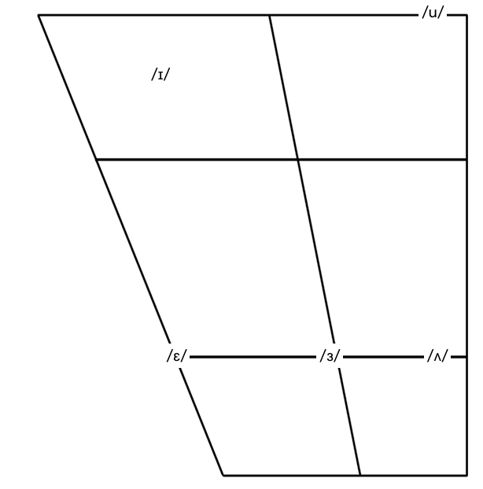

# Table of Contents
- [Phonology](#phonology)
	- [Consonants](#consonants)
	- [Vowels](#vowels)
- [Orthography](#orthography)
- [Related Links](#related-links)

# Phonology
## Consonants

## Vowels

# Orthography

| Romanized |  IPA  |
| --------- | ----- |
| ē		 | /ɜ/   |
| s̄		 | /ʃ/   |
| ö		 | /o/   |
| á		 | /ʌ/   |
| ţ		 | /t͡ʃ/  |
| ◌́		 | /◌̌/   |
| ◌̀		 | /◌̂/   |
| ◌̂		 | /◌᷈/   |
| ◌̌         | /◌˧˦˨/ (there’s not an IPA symbol for falling-rising) |

# Related Links
- [Dictionary](dictionary.md)
- [Word Modifiers](word_modifiers.md)
- [Asking Questions](asking_questions.md)
- [Commands](commands.md)
- [Keken Alphabet](keken_alphabet.md)
- [Adverbs](adverbs.md)